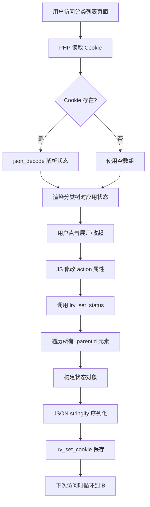

我来帮你分析这个 Cookie 值的设置和获取方法。让我先查看相关代码。
现在让我查看前端模板文件，了解完整的设置逻辑：
完美！现在我已经完全了解了这个 Cookie 的设置和获取机制。让我为你详细说明：

## `$_COOKIE['category_show_status_'.self::$siteid]` 值的设置及获取方法

### 📖 **功能说明**
这个 Cookie 用于保存**分类树的展开/收起状态**，让用户在刷新页面后仍能保持之前的操作习惯。

---

### 🔍 **1. 获取方法（后端 PHP）**

**位置：** [category.class.php](file:///home/lirongyaoper/Projects/lryblog.com/application/lry_admin_center/controller/category.class.php#L39)

```php
$category_show_status = isset($_COOKIE['category_show_status_'.self::$siteid]) 
    ? json_decode($_COOKIE['category_show_status_'.self::$siteid], true) 
    : array();
```

**说明：**
- Cookie 名称格式：`category_show_status_{站点ID}`
- 值格式：JSON 字符串，存储格式为 `{分类ID: 状态}`
- 状态值：
  - `'1'` = 收起状态
  - `'2'` = 展开状态
- 解码后得到关联数组，例如：`[3 => '1', 5 => '2']`

---

### 💾 **2. 设置方法（前端 JavaScript）**

**位置：** [category_list.html](file:///home/lirongyaoper/Projects/lryblog.com/application/lry_admin_center/view/category_list.html#L75-L81)

#### **设置函数**
```javascript
function lry_set_status(){
    var category_show_status = {};
    $(".parentid").each(function () {
        category_show_status[$(this).attr("catid")] = $(this).attr("action");
    })
    lry_set_cookie('category_show_status_<?php echo self::$siteid;?>', 
                   JSON.stringify(category_show_status));
}
```

#### **Cookie 设置底层函数**
位置：[category_list.html](file:///home/lirongyaoper/Projects/lryblog.com/application/lry_admin_center/view/category_list.html#L48-L73)

```javascript
function lry_set_cookie(name, value, hours) {
    var str = name + "=" + encodeURIComponent(value);
    
    if (hours > 0) {
        var date = new Date();
        var ms = hours * 3600 * 1000;
        date.setTime(date.getTime() + ms);
        str += "; expires=" + date.toUTCString();
    }
    
    str += "; path=/; SameSite=Lax;";
    document.cookie = str;
}
```

---

### 🎯 **3. 触发时机**

#### **场景 1：点击单个分类展开/收起图标**
位置：[category_list.html](file:///home/lirongyaoper/Projects/lryblog.com/application/lry_admin_center/view/category_list.html#L99-L113)

```javascript
$(".parentid").click(function () {
    var action = parseInt($(this).attr("action"));
    switch (action) {
        case 1: //展开
            $(this).attr('action', 2).html('&#xe653;');
            break;
        case 2: //收起
            $(this).attr('action', 1).html('&#xe652;');
            break;
    }
    lry_set_status(); // 保存状态到 Cookie
})
```

#### **场景 2：点击全局展开/收起按钮**
位置：[category_list.html](file:///home/lirongyaoper/Projects/lryblog.com/application/lry_admin_center/view/category_list.html#L83-L97)

```javascript
function lry_tree_toggle(obj) {
    var isshow = $(obj).attr("isshow");
    if(isshow == "0"){
        $(".top .parentid").attr('action', 2).html('&#xe653;'); // 全部展开
    }else{
        $(".top .parentid").attr('action', 1).html('&#xe652;'); // 全部收起
    }
    lry_set_status(); // 保存状态到 Cookie
}
```

---

### 🔄 **4. 完整流程**



---

### 📊 **5. 数据示例**

**存储在 Cookie 中的原始值：**
```
category_show_status_1=%7B%223%22%3A%221%22%2C%225%22%3A%222%22%7D
```

**URL 解码后：**
```json
{"3":"1","5":"2"}
```

**PHP 解析后的数组：**
```php
Array(
    [3] => '1',  // 分类ID 3 处于收起状态
    [5] => '2'   // 分类ID 5 处于展开状态
)
```

---

### 🎨 **6. 状态对应的图标**

在 [category.class.php](file:///home/lirongyaoper/Projects/lryblog.com/application/lry_admin_center/controller/category.class.php#L91-L98) 中：

```php
$icon = '&#xe653;';   // 默认展开图标
$action = '2';        // 默认操作状态（点击后收起）

if($category_show_status && $category_show_status[$val['id']] == '1'){
    $icon = '&#xe652;';   // 收起图标
    $action = '1';        // 操作状态（点击后展开）
}
```

---

### ✅ **总结**

| 项目 | 说明 |
|------|------|
| **Cookie 名称** | `category_show_status_{站点ID}` |
| **存储格式** | JSON 字符串 `{"分类ID":"状态"}` |
| **设置位置** | 前端 JS - `lry_set_status()` 函数 |
| **获取位置** | 后端 PHP - `category::init()` 方法第39行 |
| **触发时机** | 点击展开/收起图标或全局切换按钮 |
| **作用范围** | 当前站点的分类树状态记忆 |