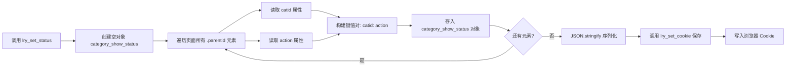

我来详细分析这个 `lry_set_status()` 函数。
## 📋 `lry_set_status()` 函数详细分析

### 🎯 **函数功能**
保存分类树中所有顶级分类的展开/收起状态到 Cookie，用于在页面刷新后恢复用户的操作状态。

---

### 🔍 **逐行代码分析**

```javascript
function lry_set_status(){
    // 第76行：初始化空对象，用于存储所有分类的状态
    var category_show_status = {};
    
    // 第77-79行：遍历所有带 .parentid 类的图标元素
    $(".parentid").each(function () {
        // 将每个分类的 catid 作为键，action 作为值存入对象
        category_show_status[$(this).attr("catid")] = $(this).attr("action");
    })
    
    // 第80行：将状态对象序列化并保存到 Cookie
    lry_set_cookie('category_show_status_<?php echo self::$siteid;?>', 
                   JSON.stringify(category_show_status));
}
```

---

### 🧩 **关键元素说明**

#### **1. `.parentid` 选择器**
- **对应 HTML：** 在 [category.class.php](file:///home/lirongyaoper/Projects/lryblog.com/application/lry_admin_center/controller/category.class.php#L107) 第107行生成
```php
$val['parentoff'] = $val['parentid'] ? '' : 
    '<i class="lry-iconfont parentid" catid="'.$val['id'].'" action="'.$action.'">
        '.$icon.'
    </i> ';
```

- **特点：** 只有**顶级分类**才有这个图标（`parentid` 为空时生成）
- **HTML 示例：**
```html
<i class="lry-iconfont parentid" catid="3" action="2">&#xe653;</i>
<i class="lry-iconfont parentid" catid="5" action="1">&#xe652;</i>
```

#### **2. 关键属性**

| 属性 | 说明 | 取值 |
|------|------|------|
| `catid` | 分类 ID | 数字（如 `"3"`, `"5"`) |
| `action` | 当前状态 | `"1"` = 收起状态<br>`"2"` = 展开状态 |

---

### 🔄 **执行流程图**



---

### 📊 **数据转换示例**

假设页面有 3 个顶级分类：

**HTML 元素：**
```html
<i class="lry-iconfont parentid" catid="1" action="2">&#xe653;</i>
<i class="lry-iconfont parentid" catid="3" action="1">&#xe652;</i>
<i class="lry-iconfont parentid" catid="5" action="2">&#xe653;</i>
```

**执行过程：**

1. **遍历第1个元素** → `category_show_status["1"] = "2"`
2. **遍历第2个元素** → `category_show_status["3"] = "1"`
3. **遍历第3个元素** → `category_show_status["5"] = "2"`

**最终对象：**
```javascript
{
    "1": "2",  // 分类1 展开
    "3": "1",  // 分类3 收起
    "5": "2"   // 分类5 展开
}
```

**序列化后：**
```json
{"1":"2","3":"1","5":"2"}
```

**存入 Cookie：**
```
category_show_status_1 = {"1":"2","3":"1","5":"2"}
```

---

### 🎬 **调用时机**

这个函数在以下两个场景被调用：

#### **场景1：单个分类展开/收起**
位置：第99-113行
```javascript
$(".parentid").click(function () {
    var action = parseInt($(this).attr("action"));
    switch (action) {
        case 1: // 当前收起 → 点击后展开
            $(this).attr('action', 2).html('&#xe653;');
            break;
        case 2: // 当前展开 → 点击后收起
            $(this).attr('action', 1).html('&#xe652;');
            break;
    }
    lry_set_status(); // ✅ 保存新状态
})
```

#### **场景2：全局展开/收起**
位置：第83-97行
```javascript
function lry_tree_toggle(obj) {
    if(isshow == "0"){
        $(".top .parentid").attr('action', 2); // 全部展开
    }else{
        $(".top .parentid").attr('action', 1); // 全部收起
    }
    lry_set_status(); // ✅ 保存新状态
}
```

---

### 🔗 **与后端的配合**

1. **前端保存状态：** `lry_set_status()` → Cookie
2. **后端读取状态：** [category.class.php#L39](file:///home/lirongyaoper/Projects/lryblog.com/application/lry_admin_center/controller/category.class.php#L39)
```php
$category_show_status = isset($_COOKIE['category_show_status_'.self::$siteid]) 
    ? json_decode($_COOKIE['category_show_status_'.self::$siteid], true) 
    : array();
```
3. **后端应用状态：** 根据 Cookie 中的状态决定显示收起/展开图标

---

### ⚠️ **注意事项**

1. **只记录顶级分类**
   - 只遍历 `.parentid` 元素（子分类没有此类）
   - 子分类的显示/隐藏由父分类控制

2. **全量保存**
   - 每次调用都保存**所有**顶级分类的状态
   - 不是增量更新，而是完全覆盖

3. **数据类型**
   - `catid` 和 `action` 都是**字符串类型**
   - 后端对比时也使用字符串：`$category_show_status[$val['id']] == '1'`

4. **Cookie 作用域**
   - 路径：`path=/`（全站可访问）
   - 有效期：未设置过期时间，关闭浏览器后失效（会话级）

---

### 💡 **函数优缺点**

| 优点 | 缺点 |
|------|------|
| ✅ 逻辑简单清晰 | ⚠️ 每次全量保存（性能影响较小） |
| ✅ 实时同步所有状态 | ⚠️ Cookie 大小限制（分类数量<100时无影响） |
| ✅ 无需关心单个元素变化 | ⚠️ 未设置过期时间（关闭浏览器丢失） |

---

### 🎯 **总结**

`lry_set_status()` 是一个**状态快照函数**，它的核心作用是：
- **采集**当前页面所有顶级分类的展开/收起状态
- **序列化**为 JSON 字符串
- **持久化**到浏览器 Cookie
- **配合**后端实现页面刷新后的状态恢复

这是一个典型的**前端状态持久化**实现方案，适用于数据量不大且需要跨请求保持状态的场景。